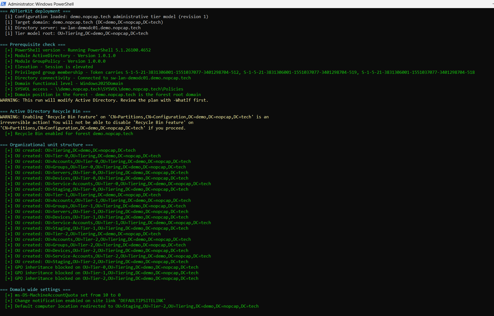
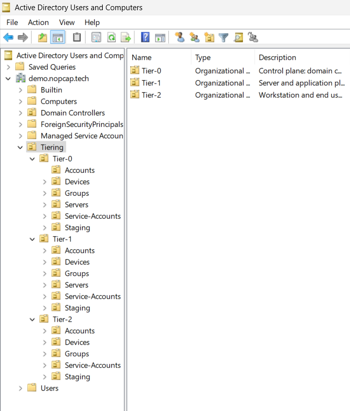
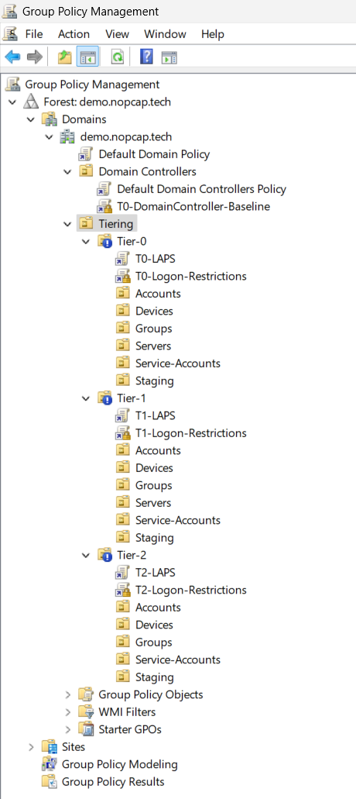

<div align="center">

# 🏛️ ADTierKit

**Deploy, audit and maintain an Active Directory tier model — from one script and one JSON file.**

<br>

[](#prerequisites)
[](#prerequisites)
[](#what-has-been-tested)
[](LICENSE)

<br>

[**Modes**](#modes) &nbsp;·&nbsp;
[**What it deploys**](#what-it-deploys) &nbsp;·&nbsp;
[**Guardrails**](#guardrails) &nbsp;·&nbsp;
[**Quick start**](#quick-start) &nbsp;·&nbsp;
[**Tested**](#what-has-been-tested) &nbsp;·&nbsp;
[**Design decisions**](#design-decisions-worth-knowing) &nbsp;·&nbsp;
[**Troubleshooting**](#troubleshooting)

</div>

<br>

```
                 ┌───────────────────────────────────────────────┐
   wizard  ──▶   │            config/tiermodel.json              │   ◀── you edit this
                 │              the source of truth              │
                 └───────────────────────────────────────────────┘
                            │            │            │
                     deploy │      audit │       sync │
                            ▼            ▼            ▼
                     converges     reports the    keeps membership
                    the directory     drift          current
```

<div align="center">
  <a href="docs/deployment.png"></a>
  <br>
  <sub>A full deployment. Every stage reports what it created, skipped or found compliant.</sub>
</div>

<br>

Tiering an Active Directory is not hard to understand and very hard to finish. The structure can
be built in an afternoon; deciding which of nine hundred existing servers belongs to which tier
cannot, and the projects that stall usually stall exactly there. ADTierKit is built around that
reality — it automates everything that *can* be automated, refuses to guess at the rest, and tells
you plainly which is which.

A guided wizard asks for your naming convention, previews every object it would create, and writes
a single configuration file. From then on that file is the source of truth. Everything is
idempotent, and everything plans before it writes.

The whole tool is one PowerShell script plus one JSON configuration file. No module to import, no
folder structure to preserve, no build step. Copy two files onto a domain controller and run them.

<br>

> [!CAUTION]
> **Logon rights are tattooed.** Once a logon restriction has applied, disabling the GPO link does
> **not** give the right back — the entry stays in the local security database of every machine
> that processed it, and it survives reboots. Recovery needs `secedit` run locally, which in turn
> needs a way in: the console, another machine over the network, or DSRM. Never enable these GPOs
> on a domain controller without a second route in, and keep the DSRM password to hand.
> [`Repair-TierLockout.ps1`](#when-it-goes-wrong) automates the way back.

> [!WARNING]
> **Lab-tested, not production-tested.** Every mode has been run end to end against a Windows
> Server 2025 lab domain, idempotency is verified at `Created: 0`, and the tier separation was
> confirmed with real accounts in both directions — see [what has been
> tested](#what-has-been-tested). It has never run against a production directory, has no Pester
> suite and has not been reviewed by a second engineer. Take a system state backup of a domain
> controller before the first enforced deployment.

> [!NOTE]
> **Built with AI assistance.** Most of the code and documentation in this repository was written
> by Claude (Anthropic) in a pair-programming workflow: requirements defined and reviewed by a
> human, implementation by the model. As with any code you did not write yourself, review it
> before running it in production.

---

## Contents

| Getting there | Understanding it | When you need it |
|---|---|---|
| [Modes](#modes) | [Design decisions](#design-decisions-worth-knowing) | [Troubleshooting](#troubleshooting) |
| [What it deploys](#what-it-deploys) | [Configuration reference](#configuration-reference) | [When it goes wrong](#when-it-goes-wrong) |
| [Guardrails](#guardrails) | [Reports and logging](#reports-and-logging) | [Checking the code](#checking-the-code) |
| [Prerequisites](#prerequisites) | [What has been tested](#what-has-been-tested) | [Limitations & notes](#limitations--notes) |
| [Quick start](#quick-start) | | [Repository layout](#repository-layout) |
| [Rollout order](#recommended-rollout-order) | | [License](#license) |

---

## Modes

| Command | Writes? | Purpose |
| --- | :---: | --- |
| `.\ADTierKit.ps1` | ⚠️ | **Interactive wizard.** Asks for the naming convention, previews the result, writes the configuration, optionally starts the deployment. Start here. |
| `.\ADTierKit.ps1 -Mode Deploy` | ⚠️ | Applies the configuration. **Plans by default** — writes only with `-Apply`. Staged rollout via `-Stage`. |
| `.\ADTierKit.ps1 -Mode Audit` | — | Read-only drift and hygiene report with severity classification. |
| `.\ADTierKit.ps1 -Mode Sync` | ✅ | Re-runs only the membership stages. Safe to schedule. |
| `.\ADTierKit.ps1 -Mode InstallTask` | ✅ | Registers a daily scheduled task that runs `Sync` as SYSTEM. |
| `.\ADTierKit.ps1 -Mode Check` | — | Prerequisite check only. |

⚠️ needs `-Apply` before anything is written · ✅ writes to the directory · — read-only

**Exit codes** &nbsp; `0` success &nbsp;·&nbsp; `1` deploy failures &nbsp;·&nbsp; `2` drift found &nbsp;·&nbsp; `3` prerequisites failed &nbsp;·&nbsp; `4` high severity findings

---

## What it deploys

```
OU=Tiering
├── OU=Tier-0                     control plane — domain controllers, PKI, identity
│   ├── OU=Accounts               adm-t0-*, break glass
│   ├── OU=Groups                 G-T0-Admins · G-T0-Operators · DL-T0-*
│   ├── OU=Servers                Tier 0 member servers
│   ├── OU=Devices                privileged access workstations
│   ├── OU=Service-Accounts
│   └── OU=Staging                landing zone before production
├── OU=Tier-1                     server plane — applications, databases, file services
│   └── … same shape
└── OU=Tier-2                     workplace plane — clients and their administrators
    └── … same shape
```

| Stage | What it creates |
| --- | --- |
| `RecycleBin` | Enables the AD Recycle Bin, so a mistake during rollout is recoverable without an authoritative restore. Irreversible and forest-wide. |
| `OU` | Tier model root plus one branch per tier, each with sub-OUs for accounts, groups, servers, devices, service accounts and staging. Protected from deletion, with Group Policy inheritance blocked. |
| `Domain` | Sets `ms-DS-MachineAccountQuota`, redirects the default location for new computer accounts away from `CN=Computers`, enables replication change notification on the site links. |
| `Group` | Per tier: global role groups (admins, operators) and domain local access groups (local admins, remote desktop, deny logon). |
| `Nesting` | Cross-tier nesting — in particular the deny-logon group that holds the *other* tiers' principals. |
| `Account` | Disabled template and break-glass accounts, flagged sensitive-and-cannot-be-delegated, optionally added to `Protected Users`. Passwords exported DPAPI-encrypted. |
| `Delegation` | Explicit ACEs so each tier administers only its own branch — including the full domain-join permission set, and deliberately excluding `WriteDacl` and `WriteOwner`. |
| `PrivilegedGroups` | Compares `Domain Admins`, `Enterprise Admins`, `Schema Admins`, `Key Admins` and the `Account` / `Server` / `Print` / `Backup Operators` against their declared membership. Reports by default, corrects in enforce mode. |
| `Auditing` | SACL audit entries on the model root and the Domain Controllers OU, so changes to the structure and its delegation produce directory service change events. |
| `GPO` | Per-tier logon restriction GPOs: deny rights for foreign-tier principals, restricted groups for local `Administrators` and `Remote Desktop Users`, UNC hardened paths, plus an exception group per GPO. |
| `Laps` | Windows LAPS: schema extension, per-tier read and reset permissions, and one policy GPO per tier with its own decryption principal. |
| `KDS` | KDS root key, the prerequisite for gMSA and dMSA. |
| `Silo` | One Kerberos authentication policy and silo per administrative tier. Deployed in audit mode by default. |

<table>
<tr>
<td width="50%" valign="top" align="center">
  <a href="docs/result-aduc.png"></a>
  <br>
  <sub><b>The result in ADUC</b><br>Three tiers, each with the same six sub-OUs.</sub>
</td>
<td width="50%" valign="top" align="center">
  <a href="docs/result-gpmc.png"></a>
  <br>
  <sub><b>The result in GPMC</b><br>Logon restrictions and a LAPS policy per tier, plus the domain controller baseline.</sub>
</td>
</tr>
</table>

The isolation logic is deliberately simple and reviewable: each tier has exactly one deny-logon group, and the GPO denies that single SID the logon types that matter. Changing who is locked out of a tier is a group membership change, not a GPO edit.

---

## Guardrails

> A tool that removes logon rights can lock you out of the domain it is meant to secure.
> These are the mechanisms that stop that from happening — and every one of them exists in
> response to a way it actually went wrong.

### The lockout guard

Before a single logon restriction is written, deployment resolves every deny group **recursively**
and checks it against two identities that must not lose access: the account running the
deployment, and the built-in `Administrator`. If either would be denied, the GPO stage is skipped
entirely, and the finding names the policy, the group and the target:

```
[!] LOCKOUT RISK - the logon restriction stage was not applied
[!]   T0-DomainController-Baseline denies logon to DL-T0-DenyLogon on
      OU=Domain Controllers,DC=... , which contains the account running this deployment
```

The check is deliberately **narrow**, and that is the interesting part. Cross-tier denial is the
whole point of the model: a Tier 0 account is *supposed* to lose its logon rights on Tier 1 and
Tier 2 systems, and once the top tier group is nested into `Domain Admins` as the configuration
declares, every Tier 0 account is a Domain Admin sitting in the other tiers' deny groups. A guard
that flagged that would fire on every correctly configured domain — and a warning that always
fires is one nobody reads. So it examines only the policies that reach a machine you would need in
order to *fix* the result: the domain controller, and the host the script runs from.

`-Force` overrides it. The override is then recorded as a deliberate decision rather than a
failure, so the next run's summary stays meaningful. Audit mode reports the same check as a high
severity finding, which catches a membership added *after* deployment.

### The rest of them

| Guardrail | What it prevents |
|---|---|
| **Plan by default** | `-Mode Deploy` writes nothing without `-Apply`. A mistyped command line cannot change the directory. |
| **The DC baseline names its own allow side** | A template that writes only deny entries relies on the allow side being held somewhere else — and on a domain controller that can be an implicit default rather than a policy. The baseline writes `SeInteractiveLogonRight` and `SeRemoteInteractiveLogonRight` explicitly, so applying it can never leave the controller without an administrative logon path. |
| **No empty rights are ever written** | `SeSomeRight =` with nothing after it does not mean "leave alone", it means "nobody holds this right". A right whose principals fail to resolve is skipped rather than emptied. |
| **Enforce mode has three unremovable guards** | The built-in `Administrator` is never removed from a privileged group, nor is the account running the deployment, and `Domain Admins` is never emptied — if enforcing would leave it without members, the group is skipped and reported. |
| **Disabled links stay disabled** | Each GPO carries a `linkEnabled` flag. A link you disabled to get out of trouble is not silently switched back on by the next deployment. |
| **The Recycle Bin goes first** | The first stage enables the AD Recycle Bin, so a mistake later in the same run is recoverable without an authoritative restore. |
| **Tattooing is stated out loud** | Every run warns, before writing logon rights, that disabling the link later will not give a removed right back. |
| **Silos start in audit mode** | Authentication policy silos deploy with enforcement off, so you can watch events 4820 / 4821 before anything is actually denied. |
| **Break-glass stays outside** | The generated break-glass account is excluded from the silo and from `Protected Users` by design. |
| **No silent failures** | Every failure path writes to the log, not just to the report object. A problem that only shows up as a number in the summary is a problem nobody finds. |

And if it goes wrong anyway, [`Repair-TierLockout.ps1`](#when-it-goes-wrong) is the way back.

---

## Prerequisites

| Requirement | Detail |
| --- | --- |
| Domain functional level | 2012 R2 minimum. 2016+ for authentication policy silos and LAPS password encryption. |
| PowerShell | 5.1 or 7.x with the `ActiveDirectory` and `GroupPolicy` modules (RSAT). |
| Privileges | Elevated session, member of `Domain Admins`. Schema Admins additionally for the LAPS schema extension. |
| Access | Write access to `\\<domain>\SYSVOL\<domain>\Policies`. |
| Host | The `Domain` stage needs a domain controller (`redircmp` / `redirusr` ship with the AD DS role). The `Laps` stage needs the LAPS module — Windows Server 2022 / Windows 11 22H2 and later. |

Run `.\ADTierKit.ps1 -Mode Check` to verify all of it, including whether the target domain is the forest root.

---

## Quick start

**1. Unblock the files** after copying them to the server:

```powershell
Get-ChildItem C:\ADTierKit -Recurse | Unblock-File
cd C:\ADTierKit
```

**2. Run the wizard:**

```powershell
.\ADTierKit.ps1
```

Eight sections, every question with an example and a default. Naming patterns resolve live, so you see the real object names before accepting them:

```
  Naming pattern for global role groups?
    Available placeholders: {ID}, {ROLE}, {TIER}, {TOKEN}, {TOKENLC}
    Example : G-{TOKEN}-{ROLE}  ->  G-T0-Admins
    Default : G-{TOKEN}-{ROLE}
  > GG_{TOKEN}_{ROLE}
    Resolves to: GG_T0_Admins
```

<div align="center">
  <a href="docs/wizard.png"></a>
  <br>
  <sub>Every question carries an example and a default, and naming patterns resolve as you type.</sub>
</div>

The sections in order: domain and root container · tier layout · sub-OU names · group naming · administrative accounts · Group Policy · authentication policy silo · remaining options.

<div align="center">
  <a href="docs/wizard-preview.png"></a>
  <br>
  <sub>Nothing is written until you have seen the complete object list, with the purpose of every group spelled out.</sub>
</div>

Afterwards you get a full preview — OU tree, every group, accounts, GPOs, LAPS delegation and the cross-tier deny matrix — then the configuration is written and you choose whether to dry-run, deploy the structure only, deploy everything, or exit.

`.\ADTierKit.ps1 -UseDefaults` accepts every default without prompting, which is a fast way to produce a reference configuration and edit it by hand.

**3. Deploy in stages:**

```powershell
# Plan — this is what Deploy does without -Apply, nothing is written
.\ADTierKit.ps1 -Mode Deploy

# Structure first, policy later
.\ADTierKit.ps1 -Mode Deploy -Apply -Stage RecycleBin,OU,Domain,Group,Nesting,Account,Delegation,Auditing
.\ADTierKit.ps1 -Mode Deploy -Apply -Stage GPO,Laps,KDS,Silo

# Check for drift at any time
.\ADTierKit.ps1 -Mode Audit
```

---

## Recommended rollout order

Deploying tiering in one shot is how people lock themselves out.

```
  1. Structure  ──▶  2. Populate  ──▶  3. Empty built-ins  ──▶  4. GPOs in report mode
     nobody              move objects,     Domain Admins &          link to staging,
     affected            add admins        friends                  watch for failures
                                                                         │
       7. Silo enforce  ◀──  6. Enforce  ◀──  5. Verify a fresh logon  ◀─┘
          after 4820/4821       populate the      in a second session
          are clean             deny groups
```


1. **Structure only** — `-Stage RecycleBin,OU,Domain,Group,Nesting,Account,Delegation,Auditing -Apply`. Nothing is enforced yet; nobody is affected.
2. **Populate** — move servers, workstations and service accounts into the tier OUs, starting with the **staging** OU of each tier rather than production. Add real administrators to the role groups, and give each admin a separate account per tier they work in.
3. **Empty the built-in groups** — run `-Stage PrivilegedGroups` in `Report` mode, work through the list, then switch `privilegedGroups.mode` to `Enforce`.
4. **GPOs in report mode** — link them to the staging OUs first, or link them with the deny groups temporarily emptied, and watch logon failures in the event log.
5. **Verify a fresh logon** — with a second session already open, apply the policy, run `gpupdate /force`, and confirm a *new* logon works in a third session before closing the second.
6. **Enforce** — populate the deny groups and let the GPOs apply to the full tier OUs.
7. **Silo enforcement** — flip `authenticationPolicyEnforcement` from `Audit` to `Enforce` only after event IDs 4820 / 4821 have been clean for a few weeks.

Keep at least one break-glass account **outside** the silo and outside `Protected Users`. The generated configuration does this via `"excludeFromSilo": true`.

---

## What has been tested

<div align="center">

**205** objects deployed &nbsp;·&nbsp; **0** failures &nbsp;·&nbsp; **0** created on the second run &nbsp;·&nbsp; **6/6** modes exercised

</div>

Every mode has been run end to end against a Windows Server 2025 lab domain, and the tier
separation was verified by using it — not by reading the log.

### The deployment cycle

| Check | Result |
|---|---|
| Full deployment, 13 stages | 205 objects created, 0 failures |
| **Idempotency** — same command again | `Created: 0 · Updated: 0 · Compliant: 205 · Failed: 0` |
| Audit against a live model | 205 objects recognised as compliant, no false drift |
| Plan mode (`-Mode Deploy` without `-Apply`) | 104 planned, nothing written, log and report still produced |
| Staged rollout (`-Stage`) | Structure and policy deployable separately |

Idempotency is the one worth dwelling on. Every stage has to recognise its own work on the second
run — including 39 delegation ACEs compared on rights, object type *and* inherited object type,
SACL entries read through the `AD:` provider, GPO links, security template contents, and LAPS
permissions on both the OU ACL and the extended rights. Getting this to `Created: 0` took several
rounds; a check too loose duplicates ACEs on every run, one too strict reports everything as
missing forever.

### The separation actually works

This is the part that matters, and it was verified from both directions with real accounts:

| Test | Expected | Result |
|---|---|---|
| Tier 1 account logs on to a Tier 1 server | allowed | ✅ |
| Tier 1 account logs on to the domain controller | denied | ✅ |
| Tier 1 admin reads the LAPS password of a Tier 1 server | allowed | ✅ |
| **Domain Admin** reads the same LAPS password | denied | ✅ |

The last row is the one to appreciate. A Domain Admin has full read access to every attribute in
the directory and still cannot recover that password, because the per-tier
`ADPasswordEncryptionPrincipal` means only `G-T1-Admins` holds the decryption key. That is the
whole argument for setting it per tier rather than once.

### Membership maintenance

A server moved into a tier OU and an account added to a tier group *after* deployment were both
picked up by `-Mode Sync` and assigned to the authentication silo — the gap that a one-off
deployment leaves open. The same sync was then run unattended through the scheduled task under
`SYSTEM`, with a deliberately broken group nesting restored automatically:

```
[SUCCESS] Nested G-T0-Admins into DL-T2-DenyLogon
```

### The guardrails were tested by triggering them

The lockout guard was verified the hard way: an earlier build without it locked the operator out
of the domain controller entirely — recovered through DSRM and `secedit`. The guard was written in
response, and on the rebuild it correctly blocked the GPO stage when a Domain Admin account sat in
a deny group that reached the domain controller, while staying silent for the cross-tier denial
that is the model working as intended.

`Repair-TierLockout.ps1` was written and used during that recovery, not afterwards from theory.

### Static analysis

`Invoke-ScriptAnalyzer` reports no errors. The findings it did produce were acted on: four
swallowed exceptions — two of them inside the lockout guard itself, where a failure would have
silently disabled the protection — and a plaintext password parameter that is now a
`SecureString`. See [Checking the code](#checking-the-code) for the rules that remain excluded and
why.

### What has *not* been tested

Honestly, because the list matters as much as the one above: no production directory, no
multi-domain forest, no Pester suite, no second engineer's review, and no code signing.
`privilegedGroups.mode: Enforce`, `restrictedGroupsMode: Replace`, `logonRightsMode: AllowList` and
silo `Enforce` have all been deployed but never enforced against a populated directory — those are
the four switches with the largest blast radius, and they are the ones to introduce slowly.

---

## Design decisions worth knowing

These are the places where the tool takes a position. Each one is configurable.

### Network logon is not denied across tiers by default

Interactive, remote interactive, batch and service logon place reusable credentials on a machine — those are denied across tiers. `SeDenyNetworkLogonRight` is different: it is what remote management, monitoring agents, backup software and plain file access use. Denying it across tiers produces failures far away from the policy that caused them, and the symptom rarely points back to Group Policy.

The default therefore denies network logon only to `S-1-5-113` (any local account) and `S-1-5-32-546` (Guests) — the part that actually blocks pass-the-hash with local credentials.

### Deny list or allow list

The generated GPOs state who may **not** log on. Choosing **AllowList** in the wizard adds the positive side, so anyone not listed loses the right. That is default-deny and materially stronger — and it is also how you lock yourself out.

Two deliberate omissions in the generated allow lists: `SeServiceLogonRight` and `SeBatchLogonRight` are **not** included, because an allow list on those stops every domain service account not named in it. And `Authenticated Users` stays in `SeNetworkLogonRight`, because removing it makes the machine unreachable over the network.

Before enforcing an allow list, work out which accounts actually run services and scheduled tasks on the machines in that tier — the security log (event 4624, logon type 5 for service and 4 for batch) is the only reliable source, because the directory cannot tell you which account runs what where. Audit mode lists the candidates; confirming them is manual work.

Collect over weeks, not days: a monthly job or a quarterly maintenance account will not have run in a short window, and it will be missing from the list. Machines that were switched off during the collection contribute nothing either — and those are exactly the ones whose service accounts you would omit.

### Granular delegation instead of full control

By default a tier administrator gets `CreateChild, DeleteChild` for the object classes their branch holds, plus `ReadProperty, WriteProperty, Delete, DeleteTree, ExtendedRight, Self` on everything below it. Absent are `WriteDacl` and `WriteOwner`.

That omission is the point: with `GenericAll` a tier administrator can rewrite the delegation that constrains them, which makes the tier boundary advisory rather than binding. Choosing **FullControl** in the wizard restores the old behaviour if a workflow needs it — or add a single `GenericAll` delegation to the JSON yourself.

### Restricted groups: `MemberOf` versus `Replace`

`MemberOf` (default) declares each access group a member of the local group; existing members are left alone and nobody can be locked out. `Replace` enforces the listed members as the *only* members — on every refresh everything else is removed, **including `Domain Admins`**. That is the correct end state, but only switch to it once the access groups are populated and you have verified access with a real tier account.

### Everything privileged is addressed by SID

`Domain Admins`, `Administrators`, `Account Operators`, `Protected Users` — all built-in group names are localised. A German directory calls them `Domänen-Admins` and `Administratoren`. Looking them up by name silently finds nothing, and the audit then cheerfully reports "no problems". Every privileged group in this tool is resolved through its well-known SID, so a localised directory works unchanged.

### Membership does not stay correct by itself

Deployment is a one-off event; membership is not. A server moved into a tier OU next month does not join the authentication silo on its own, and nothing in the directory notices.

```powershell
.\ADTierKit.ps1 -Mode Sync          # group nesting + silo assignment, nothing else
.\ADTierKit.ps1 -Mode InstallTask   # daily at 03:30 as SYSTEM
```

---

## Configuration reference

The configuration is one JSON document, normally `config/tiermodel.json`. The wizard generates it, but it is plain JSON meant to be edited, diffed and version-controlled.

### Naming placeholders

| Placeholder | Example | Available in |
| --- | --- | --- |
| `{ID}` | `0` | all patterns |
| `{TIER}` | `Tier-0` | all except the tier name itself |
| `{TOKEN}` / `{TOKENLC}` | `T0` / `t0` | all except the tier token itself |
| `{ROLE}` | `Admins` | role group pattern |
| `{RESOURCE}` | `DenyLogon` | access group pattern |
| `{PURPOSE}` | `template`, `Logon-Restrictions` | account and GPO patterns |

### OU references

Used anywhere a `targetOu` appears:

| Value | Resolves to |
| --- | --- |
| `""` | the tier root OU |
| `"Servers"` | `OU=Servers,OU=<tier>,<model root>` |
| `"Tier-1/Servers"` | explicit path below the model root |
| `"$DomainRoot"` | the domain naming context |
| `"$DomainControllers"` | `OU=Domain Controllers,<domain>` |
| `"OU=…,DC=…"` | used verbatim |

### Selected options

| Option | Effect |
| --- | --- |
| `machineAccountQuota` | Value for `ms-DS-MachineAccountQuota`; ships as `0`. The AD default of `10` lets any authenticated user create computer accounts — the entry point for resource-based constrained delegation abuse. |
| `redirectComputersTo` | Target for `redircmp`. Without it, machines joined without an explicit OU land in `CN=Computers`, which cannot have Group Policy linked and therefore receives no tier policy at all. |
| `blockGpoInheritanceOnTierRoots` | Blocks Group Policy inheritance per tier, so the Default Domain Policy does not leak into Tier 0. |
| `gpos[].linkEnabled` | Per GPO: `false` keeps it linked but inactive, and a later deployment respects that instead of switching it back on. |
| `restrictedGroupsMode` | `MemberOf` (additive) or `Replace` (strict). |
| `authenticationPolicyEnforcement` | `Audit` or `Enforce`. |
| `enableAdRecycleBin`, `createKdsRootKey`, `deployWindowsLaps` | Feature switches for the corresponding stages. |

Two choices are **wizard-time, not runtime**: the logon rights mode (`Deny` / `AllowList`) and the
delegation model (`Granular` / `FullControl`). They are questions the wizard asks, and their
*result* is baked into the configuration — as the `delegations` list and the `allowedUserRights`
blocks. Adding a `logonRightsMode` key to the JSON by hand does nothing; to switch, either re-run
the wizard or edit those sections directly.

---

## Reports and logging

Every run writes a timestamped log to `.\Logs`, a JSON + HTML report to `.\Reports`, and a summary to the Windows Application event log (source `ADTierKit`, event IDs 1000 clean / 1001 medium findings / 1002 high findings or failures). Suppress the last one with `-NoEventLog`.

The HTML report is a single self-contained file — clickable severity filters, full-text search, sticky header, dark mode. No external dependencies, so it survives being emailed.

Findings are classified so a report can be triaged from the top instead of read line by line:

| Severity | Meaning |
| --- | --- |
| **High** | Something failed, or an attack path is open right now — a privileged group holding principals outside the top tier, unconstrained delegation, a missing or drifted delegation ACE |
| **Medium** | A control the model depends on is missing or has drifted — a GPO, a link, a silo assignment |
| **Low** | A structural object is missing with no immediate security impact |
| **Info** | Everything that went as planned |

---

## Troubleshooting

**The GPO exists but the restrictions do not appear in the GPMC Settings tab.**
Expected. User Rights Assignment and Restricted Groups are not exposed by the `GroupPolicy` module, so the tool writes `GptTmpl.inf` directly into SYSVOL, registers the security client side extension and bumps the GPO version. The **Edit** view shows the settings and clients apply them — the Settings *report* sometimes does not render entries written this way. Verify on a client with `gpresult /h` rather than in the report.

**Nothing changed and the output says "PLAN MODE".**
`-Mode Deploy` plans by default. Add `-Apply`. This is deliberate: a mistyped command line can never change the directory.

**`ms-DS-MachineAccountQuota` or the container redirection fails.**
`redircmp` and `redirusr` ship with the AD DS role, so the `Domain` stage has to run on a domain controller. On a management workstation it reports the tool as unavailable and skips that part.

**The LAPS stage reports the module as missing.**
The LAPS PowerShell module ships with Windows Server 2022 and Windows 11 22H2 (April 2023 update) and later. Only **Windows LAPS** is supported — the legacy Microsoft LAPS with its separate AdmPwd client uses different attributes and a different ACL model and is not handled.

**A moved computer still has its old policy.**
Group Policy applies at reboot or at the next refresh. After moving a machine into a tier OU it needs a `gpupdate /force` or a restart.

**Enforcing privileged groups skipped `Domain Admins`.**
Three guards apply in enforce mode and cannot be turned off: the built-in `Administrator` (RID 500) is never removed, the account running the deployment is never removed, and `Domain Admins` is never emptied. If enforcing would leave it without members, the group is skipped and reported as a failure. Add a declared member first.

**Silo enforcement locked out an account.**
Check event IDs 4820 and 4821 on the domain controllers — they name the account and the machine. The break-glass account is excluded from the silo by design; use it, fix the assignment with `-Mode Sync`, and set `authenticationPolicyEnforcement` back to `Audit` until the log is clean.

---

## When it goes wrong

The tier model works by removing logon rights. That is the point, and it is also the failure mode:
put the account you are working with into a tier role group, and the deny groups take its logon
rights away on the systems of every other tier.

**Why disabling the GPO does not help.** User rights are *tattooed*. When the security client-side
extension applies the policy, the entry is written into the local security database of the machine.
Unlinking or disabling the GPO afterwards only stops it being written *again* — it never removes
what is already there, and it survives reboots. The right has to be put back locally with
`secedit`, which means you need a way onto the machine first.

### Routes back in, in order

1. **Another domain-joined machine over the network.** Network logon is not denied across tiers by
   default, so PowerShell remoting to the domain controller still works even when interactive and
   remote interactive logon are gone. This is the fastest route and usually the one that works.
2. **The hypervisor console.** Only helps if *interactive* logon is still intact — if the deny hit
   both interactive and remote interactive, the console is locked too.
3. **DSRM.** Reboot into Directory Services Restore Mode and log on as `.\Administrator` with the
   DSRM password. That account is local to the machine and no domain policy touches it. Keep that
   password somewhere you can reach without the domain.

### The scripted way back

```powershell
.\Repair-TierLockout.ps1 -WhatIf          # show what would change
.\Repair-TierLockout.ps1                  # remove the memberships, restore the logon rights
.\Repair-TierLockout.ps1 -EnableGpoLinks  # and re-enable the tier GPOs, if the check comes back clean
```

Four steps, each reported before and after:

1. Removes the built-in Administrator from every tier role group — the group names come from your
   configuration, and nothing outside those groups is touched.
2. Restores the default holders of the interactive logon rights on the domain controller and
   clears the deny entries, then exports the result so you can see it rather than assume it.
   `-SkipUserRightsRestore` keeps a hardened Administrators-only setting instead.
3. Re-checks every deny group recursively against the account running the script, the built-in
   Administrator, and the members of `Domain Admins`.
4. Re-enables the GPO links — only with `-EnableGpoLinks`, and only if step 3 was clean.

### The manual way back

If the script cannot run — no PowerShell remoting, DSRM only, or you would rather see every
command — this is what it does. On the domain controller, elevated:

```powershell
@'
[Unicode]
Unicode=yes
[Version]
signature="$CHICAGO$"
Revision=1
[Privilege Rights]
SeInteractiveLogonRight = *S-1-5-32-544,*S-1-5-32-548,*S-1-5-32-549,*S-1-5-32-550,*S-1-5-32-551,*S-1-5-9
SeRemoteInteractiveLogonRight = *S-1-5-32-544
SeDenyInteractiveLogonRight =
SeDenyRemoteInteractiveLogonRight =
SeDenyBatchLogonRight =
SeDenyServiceLogonRight =
'@ | Set-Content C:\fix.inf -Encoding Unicode

secedit /configure /db C:\fix.sdb /cfg C:\fix.inf /areas USER_RIGHTS
secedit /export /areas USER_RIGHTS /cfg C:\check.txt
findstr /i "InteractiveLogonRight" C:\check.txt
```

The SIDs are Administrators, Account / Server / Print / Backup Operators and Enterprise Domain
Controllers — the Windows default for a domain controller. `-Encoding Unicode` is not optional:
`secedit` only reads UTF-16.

In DSRM, where the policy would be re-applied on the next refresh anyway, also rename the template
out of the way before rebooting:

```powershell
Get-ChildItem C:\Windows\SYSVOL\domain\Policies -Recurse -Filter GptTmpl.inf |
  Where-Object { (Get-Content $_.FullName -Raw) -match 'SeDenyRemoteInteractiveLogonRight' } |
  ForEach-Object { Rename-Item $_.FullName "$($_.Name).bak"; $_.FullName }
```

Then find out what actually happened. `scesrv.log` records every setting the security extension
touched, with timestamps:

```powershell
Get-Content C:\Windows\security\logs\scesrv.log -Tail 120
Get-ADGroupMember DL-T0-DenyLogon -Recursive | Select-Object name, objectClass
```

The second command is usually the answer: an account that should not be there, inherited through
a tier role group.

### What stops it happening again

**The lockout guard** stops the deployment before it writes a restriction that would remove your
own access on a machine you would need to undo it. It is described in full under
[Guardrails](#guardrails), along with the other eight mechanisms that exist for the same reason.

**The domain controller baseline names its own allow side.** A template that writes only deny
entries relies on the allow side being held somewhere else, and on a domain controller that can be
an implicit default rather than a policy. The baseline therefore writes
`SeInteractiveLogonRight` and `SeRemoteInteractiveLogonRight` explicitly with the administrators
group, so applying it can never leave the controller without an administrative logon path.

**Disabled links stay disabled.** Each GPO carries a `linkEnabled` flag. Setting it to `false`
keeps the GPO linked but inactive, and a later deployment respects that rather than switching it
back on — which matters exactly when you disabled a link to get out of trouble.

### Working practice

Keep a second session open. Before enabling a logon restriction, open a second administrative
session to the domain controller and leave it untouched. Then apply, run `gpupdate /force`, and
verify a *fresh* logon in a third session. If it fails, the second session is still there and the
recovery is a two-minute job instead of an evening.

---

## Checking the code

```powershell
Install-Module PSScriptAnalyzer -Scope CurrentUser
Invoke-ScriptAnalyzer -Path .\ADTierKit.ps1 -Severity Error
```

No errors as of the last commit. Running without `-Severity` adds a few hundred style findings
that are deliberate here and can be ignored:

| Rule | Why it does not apply |
|---|---|
| `PSAvoidUsingWriteHost` | The wizard and the status output *are* a console interface. `Write-Output` would put them into the pipeline and corrupt the runners' return values; `Write-Information` is not displayed by default on PowerShell 5.1. Anything that belongs in a log goes through `Write-TierLog`. |
| `PSUseShouldProcessForStateChangingFunctions` | Flags helpers that build an object or return a string. Every function that touches Active Directory does declare `SupportsShouldProcess` — that is what `-WhatIf` depends on. |
| `PSUseSingularNouns` | `LAPS` is a product name, not a plural. |
| `PSAvoidUsingPlainTextForPassword` | Matches `$CredentialDirectory`, which is a folder path rather than a secret. |
| `PSUseOutputTypeCorrectly` | Informational, and these are private helpers inside one script rather than a published module surface. |

The rules that did find real defects are all still on: `PSAvoidUsingEmptyCatchBlock` caught four
swallowed exceptions, two of them inside the lockout guard itself, and
`PSAvoidUsingConvertToSecureStringWithPlainText` led to the credential export taking a
`SecureString` instead of a plaintext string.

---

## Limitations & notes

- **Deployment is additive.** Removing an entry from the configuration does not remove the corresponding object, ACE, group member or GPO link from the directory — a run only converges what is *declared*. Clean up removed entries by hand.
- **Rollback is not automated.** Take a system state backup of a domain controller before the first enforced run. The `RecycleBin` stage exists so that a deleted OU or group is recoverable.
- **Single domain per run.** For a forest, run once per domain and keep the top tier forest-wide. `Enterprise Admins` and `Schema Admins` live in the root domain; the prerequisite check says so when the target is a child domain.
- **Domain controllers cannot be moved** out of `OU=Domain Controllers`; the top-tier restrictions are applied there through a separate linked GPO.
- **Not included:** managed service account (MSA/gMSA/dMSA) ACL delegation, ADMX central store deployment, WMI filters, functional level upgrades, and prepackaged hardening baselines such as AppLocker, BitLocker or Defender. This tool secures the tier boundary; it is not a complete hardening suite.
- **No automated tests.** The script passes PSScriptAnalyzer and has been run end to end against a
  lab domain, but there is no Pester suite and no second reviewer.

---

## Repository layout

```
README.md                     this file
LICENSE                       MIT
ADTierKit.ps1                 the entire tool
Repair-TierLockout.ps1        recovery from a logon lockout
config/tiermodel.json         your configuration — the source of truth
docs/                         screenshots used by this README
Logs/                         per-run transcript, created on first run
Reports/                      JSON + HTML reports
Credentials/                  DPAPI-encrypted passwords of generated accounts
```

`ADTierKit.ps1` is organised into regions, in the order they execute:

| Region | Contents |
| --- | --- |
| `Core` | logging, configuration loading, runtime context, name and schema GUID resolution |
| `Prompts` | console helpers for the wizard |
| `ACL` | access control and audit rule management |
| `GPO` | GPO creation, security template, CSE registration, version bump, links |
| `ConfigurationGenerator` | builds a configuration document from naming patterns |
| `DeploymentStages` | the individual stages |
| `Orchestration` | deploy, audit and sync runners plus reporting |
| `Wizard` | the interactive rollout |
| `Entry point` | mode dispatch — the only part that runs on load |

Generated account passwords are written with `Export-Clixml`, which encrypts them through DPAPI and binds them to the account and machine that produced them:

```powershell
$credential = Import-Clixml .\Credentials\adm-t0-breakglass.xml
$credential.GetNetworkCredential().Password
```

Move it into your password vault and delete the file. This matters most for the break-glass account — without it, the account exists but nobody can log on with it.

## License

[MIT](LICENSE) — see the `LICENSE` file.

<div align="center">
<br>

**Built for the part of tiering that nobody automates: keeping it correct after day one.**

<sub>Issues and pull requests welcome. If you run this against a production directory, the
maintainers would genuinely like to hear how it went.</sub>

</div>
